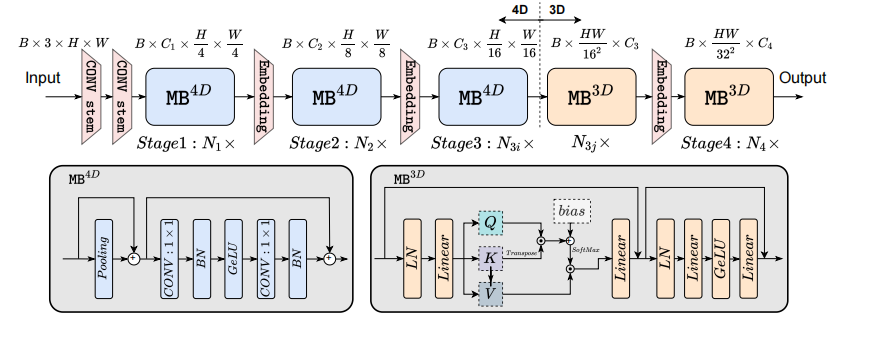
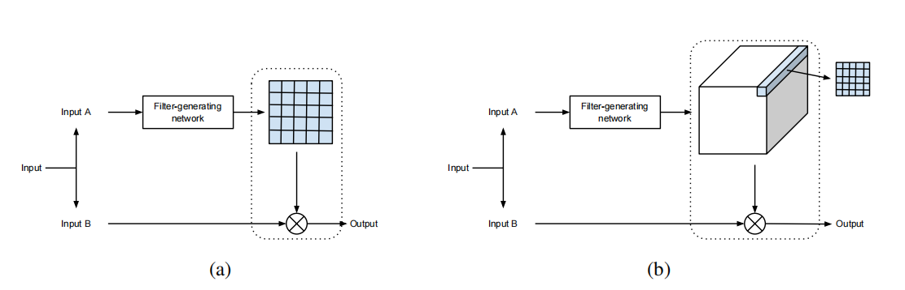
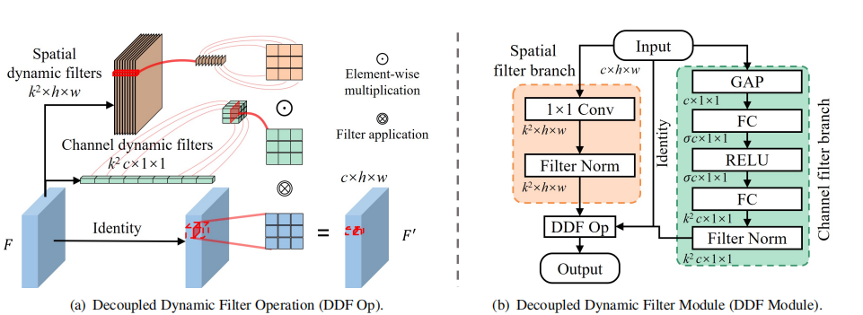
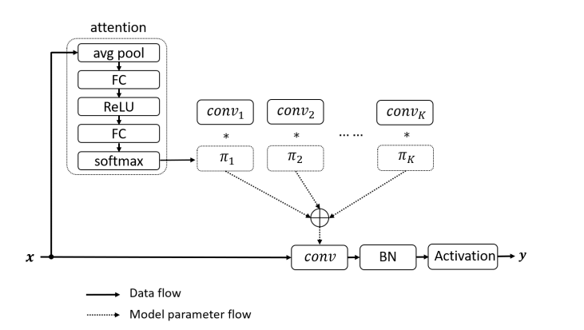

# Backbone Design 架构设计

1. **EfficientFormer: Vision Transformers at MobileNet** [paper](https://arxiv.org/abs/2206.01191) | [code](https://github.com/snap-research/efficientformer)  *arxiv 2022*

   author: Yanyu Li, Geng Yuan, Yang Wen et al. Snap Inc, Northeastern University

   > 1. propose a new **dimension-consistent design paradigm for vision transformers** which splits the network into a 4D partition where operators are implemented in CONV-net style (MB4*D*), and a 3D partition where linear projections and attentions are performed over 3D tensor to enjoy the global modeling power of MHSA without sacrificing efficiency (MB3*D*)
   >
   > 2. Observation:
   >
   >    (1) *Patch embedding with large kernel and stride is a speed bottleneck on mobile devices*
   >
   >    (2) *Consistent feature dimension is important for the choice of token mixer. MHSA is not necessarily a speed bottleneck* **(摒弃Reshape operations)**

   
   
   

# **Dynamic Convolution** 动态卷积

1. **Dynamic Filter Networks** [paper](https://arxiv.org/abs/1605.09673) | [code](https://github.com/dbbert/dfn)  *NeurIPS 2016*

   author: Bert De Brabandere, Xu Jia, Tinne Tuytelaars, Luc Van Gool. ESAT-PSI, KU Leuven

   > 1. We introduce a new framework, the *Dynamic Filter Network*, where filters are generated dynamically conditioned on an input.
   > 2. two parts: a *filter-generating network(sample-specific)* and a *dynamic filtering* layer(position-specific). 

   

2. **Decoupled Dynamic Filter Networks** [paper](https://openaccess.thecvf.com/content/CVPR2021/papers/Zhou_Decoupled_Dynamic_Filter_Networks_CVPR_2021_paper.pdf) | [code](https://github.com/theFoxofSky/ddfnet)  *CVPR 2021*

   author: Jingkai Zhou, Varun Jampani, Zhixiong Pi, Qiong Liu1, Ming-Hsuan Yang. SCUT, HUST

   > 1. standard convolution has two main shortcomings: Content-agnostic and Computation-heavy.
   > 2. DDF decouples a depth-wise dynamic filter into **spatial and channel dynamic filters**.

   

3. **Dynamic Convolution: Attention over Convolution Kernels** [paper](https://arxiv.org/abs/1912.03458) | [code](https://github.com/kaijieshi7/Dynamic-convolution-Pytorch)  *CVPR 2020*

​       author: Yinpeng Chen, Xiyang Dai, Mengchen Liu, et al.  Microsoft

> 1. we present Dynamic Convolution, a new design that increases model complexity without increasing the network depth or width. 
> 2. Instead of using a single convolution kernel per layer, dynamic convolution aggregates multiple parallel convolution kernels dynamically based upon their attentions, which are input dependent. 
> 3. Assembling multiple kernels is not only computationally efficient due to the small kernel size, but also has more representation power since these kernels are aggregated in a non-linear way via attention.

