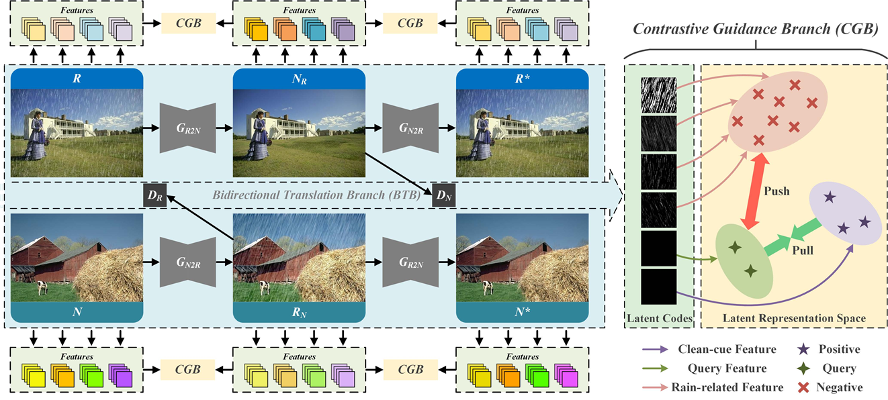
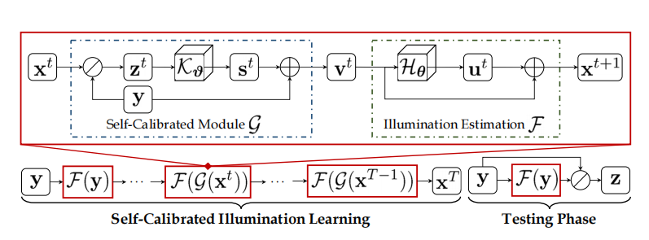
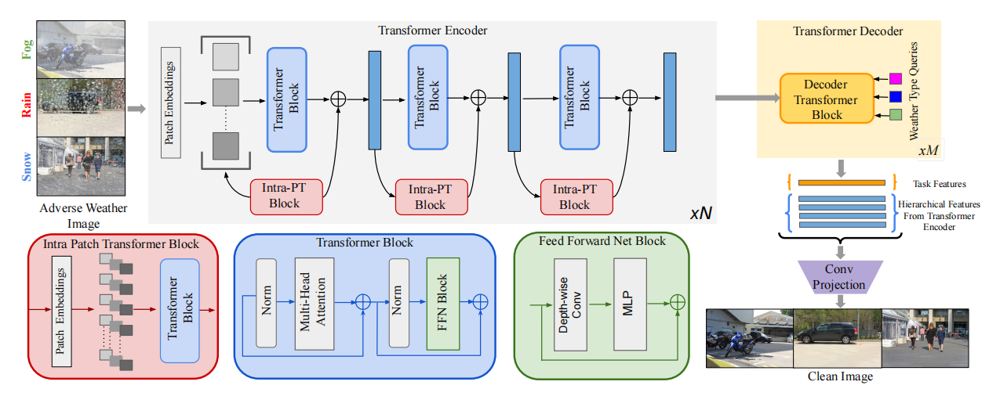
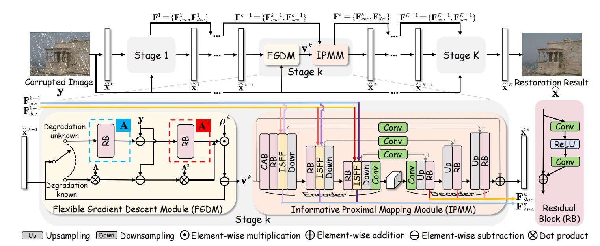
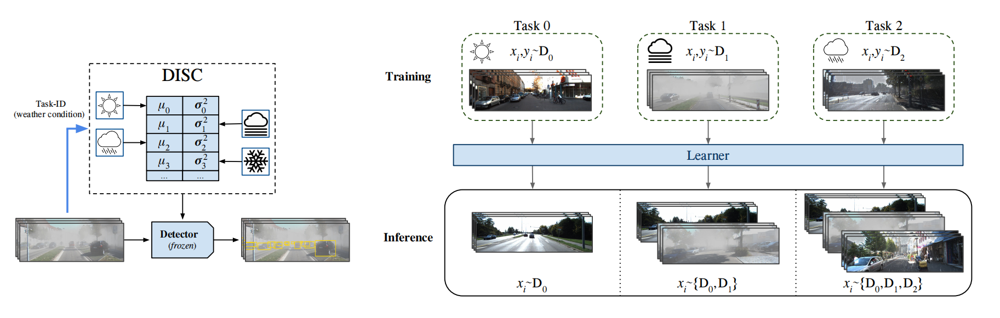
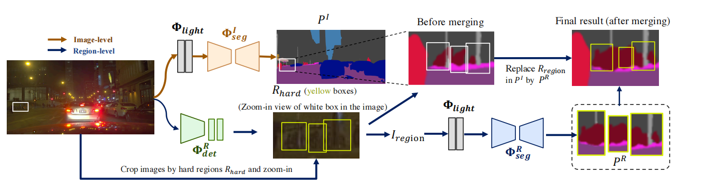
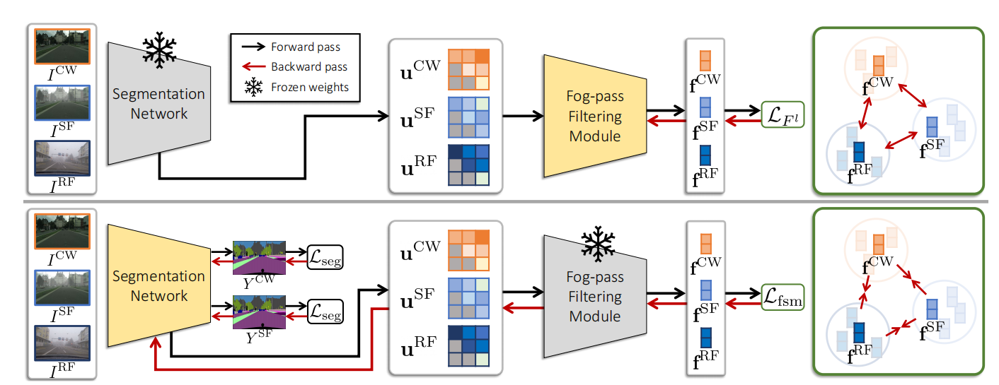
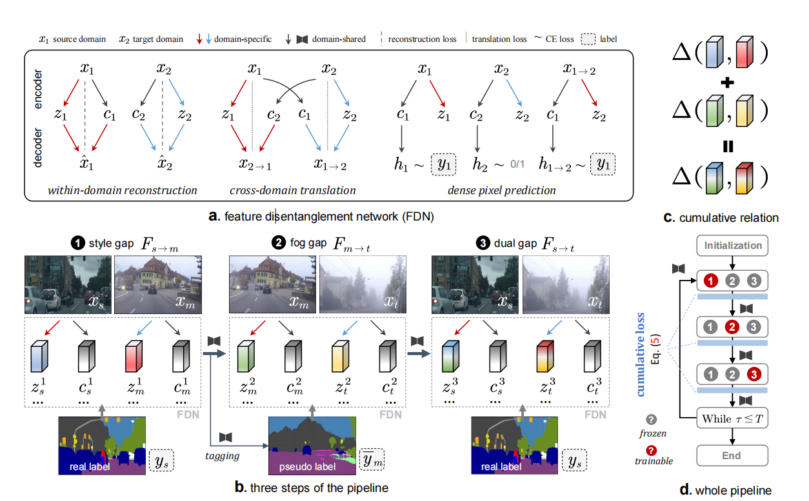

# CVPR2022

## 去雨Derain

1. **Towards Robust Rain Removal Against Adversarial Attacks: A Comprehensive Benchmark Analysis and Beyond** [paper](https://arxiv.org/abs/2203.16931) | [code](https://github.com/yuyi-sd/Robust_Rain_Removal)

   author: Yi Yu, Wenhang Yang, Yap-Peng Tan, Alex C. Kot Nanyang Technological University

   > This paper makes the first attempt to **conduct a comprehensive study on the robustness of deep learning-based rain removal methods against adversarial attacks**. 
   >
   > Our study shows that, when the image/video is highly degraded, rain removal methods **are more vulnerable to the adversarial attacks as small distortions/perturbations** become less noticeable or detectable.
   >
   > In this paper, we first present a comprehensive empirical evaluation of various methods **at different levels of attacks and with various losses/targets to generate the perturbations** from the perspective of human perception and machine analysis tasks. 
   >
   > A systematic evaluation of key modules in existing methods is performed in terms of their robustness against adversarial attacks. From the insights of our analysis, we construct **a more robust deraining method by integrating these effective modules**. 
   >
   > Finally, we examine various types of adversarial attacks that are specific to deraining problems and their effects on both human and machine vision tasks, including 1) rain region attacks, adding perturbations only in the rain regions to make the perturbations in the attacked rain images less visible; 2) object-sensitive attacks, adding perturbations only in regions near the given objects.

2. **Unpaired Deep Image Deraining Using Dual Contrastive Learning** [paper](https://arxiv.org/abs/2109.02973) | [code](https://cxtalk.github.io/projects/DCD-GAN.html)

   author: Xiang Chen, Jinshan Pan, Kui Jiang et al. Nanjing University of Science and Technology

   > Moreover, simply using existing unpaired learning methods (e.g., unpaired adversarial learning and cycle-consistency constraints) in the SID task is insufficient to learn the underlying relationship from rainy inputs to clean outputs as there exists significant domain gap between the rainy and clean images. 
   >
   > In this paper, we develop **an effective unpaired SID adversarial framework which explores mutual properties of the unpaired exemplars by a dual contrastive learning manner in a deep feature space**, named as DCDGAN. 
   >
   > The proposed method mainly consists of two cooperative branches: Bidirectional Translation Branch (BTB) and Contrastive Guidance Branch (CGB). 
   >
   > Specifically, BTB exploits full advantage of the circulatory architecture of adversarial consistency to generate abundant exemplar pairs and excavates latent feature distributions between two domains by equipping it with bidirectional mapping. 
   >
   > Simultaneously, CGB implicitly constrains the embeddings of different exemplars in the deep feature space by encouraging the similar feature distributions closer while pushing the dissimilar further away, in order to better facilitate rain removal and help image restoration. 

# 低光照增强 Low Light Enhance

1. **Toward Fast, Flexible, and Robust Low-Light Image Enhancement** [paper](https://arxiv.org/abs/2204.10137) | [code](https://github.com/vis-opt-group/sci)

   author: Long Ma, Tengyu Ma, Zhongxuan Luo et al. Dalian University of Technology

   > Existing low-light image enhancement techniques are mostly not only difficult to deal with both visual quality and computational efficiency but also commonly invalid in unknown complex scenarios. 
   >
   > In this paper, we develop a new **Self-Calibrated Illumination (SCI) learning framework** for fast, flexible, and robust brightening images in real-world low-light scenarios. 
   >
   > To be specific, we establish a cascaded illumination learning process with weight sharing to handle this task. 
   >
   > Considering the computational burden of the cascaded pattern, we construct the self-calibrated module which realizes the convergence between results of each stage, producing the gains **that only use the single basic block for inference** (yet has not been exploited in previous works), which drastically diminishes computation cost. 
   >
   > We then define the unsupervised training loss to elevate the model capability that can adapt to general scenes. 
   >
   > Further, we make comprehensive explorations to excavate SCI's inherent properties (lacking in existing works) including operation-insensitive adaptability (acquiring stable performance under the settings of different simple operations) and model-irrelevant generality (can be applied to illumination-based existing works to improve performance). 

   

## 图像复原Image Restoration

1. **TransWeather: Transformer-based Restoration of Images Degraded by Adverse Weather Conditions** [paper](https://arxiv.org/abs/2111.14813) | [code](https://github.com/jeya-maria-jose/TransWeather)

   authors: Jeya Maria Jose Valanarasu, Rajeev Yasarla and Vishal M. Patel. Johns Hopkins University

   > Most methods proposed in the literature have been designed to deal with just removing one type of degradation. 
   >
   > In this work, we focus on developing an efficient solution for the all adverse weather removal problem. To this end, we propose TransWeather, **a transformer-based end-to-end model with just a single encoder and a decoder that can restore an image degraded by any weather condition**. 
   >
   > Specifically, we utilize a novel transformer encoder using intra-patch transformer blocks to enhance attention inside the patches to effectively remove smaller weather degradations. 
   >
   > We also introduce a transformer decoder with learnable weather type embeddings to adjust to the weather degradation at hand. 

   

2. **Deep Generalized Unfolding Networks for Image Restoration**  [paper](https://arxiv.org/abs/2204.13348) | [code](https://github.com/MC-E/Deep-Generalized-Unfolding-Networks-for-Image-Restoration)

   authors: Chong Mou, Qian Wang, Jian Zhang PKUSZ

   >However, most DNN methods are designed as a black box, lacking transparency and interpretability.
   >
   >In this paper, we propose a Deep Generalized Unfolding Network (DGUNet) for image restoration. Concretely, **without loss of interpretability**, we **integrate a gradient estimation strategy into the gradient descent step of the Proximal Gradient Descent (PGD) algorithm**, driving it to deal with complex and real-world image degradation. 
   >
   >In addition, we design inter-stage information pathways across proximal mapping in different PGD iterations to rectify the intrinsic information loss in most deep unfolding networks (DUN) through a multi-scale and spatial-adaptive way. 
   >
   >By integrating the flexible gradient descent and informative proximal mapping, we unfold the iterative PGD algorithm into a trainable DNN. 

# 增量学习 Incremental Learning

**1. An Efficient Domain-Incremental Learning Approach to Drive in All Weather Conditions**  [paper](https://arxiv.org/abs/2204.08817) 

author: M. Jehanzeb Mirza, Marc Masana, Horst Possegger, Horst Bischof. Institute of Computer Graphics and Vision, Graz University of Technology

> When adapting these models for changed environments, such as different weather conditions, they are prone to **forgetting previously learned information**. 
>
> This catastrophic forgetting is typically addressed via **incremental learning** approaches which usually re-train the model by either keeping a memory bank of training samples or keeping a copy of the entire model or model parameters for each scenario. 
>
> While these approaches show impressive results, they can be prone to scalability issues and their applicability for autonomous driving in all weather conditions has not been shown.
>
> In this paper we propose DISC -- **Domain Incremental through Statistical Correction** -- a simple online zero-forgetting approach which can incrementally learn new tasks (i.e weather conditions) without requiring re-training or expensive memory banks. 
>
> The only information we store for each task are the statistical parameters as we categorize each domain by the change in first and second order statistics. Thus, as each task arrives, we simply 'plug and play' the statistical vectors for the corresponding task into the model and it immediately starts to perform well on that task. 

# 恶劣感知任务 Adverse Perception Task

**1. NightLab: A Dual-level Architecture with Hardness Detection for Segmentation at Night** [paper](https://arxiv.org/abs/2204.05538) | [code](https://github.com/xdeng7/NightLab)

author: Xueqing Deng, Peng Wang , Xiaochen Lian , Shawn Newsam. EECS, University of California at Merced

> In this paper, we propose NightLab, a novel nighttime segmentation framework that leverages multiple deep learning models imbued with night-aware features to yield State-of-The-Art (SoTA) performance on multiple night segmentation benchmarks. 
>
> Notably, NightLab contains models at two levels of granularity, i.e. **image and regional**, and each level is composed of light adaptation and segmentation modules. 
>
> Given a nighttime image, the image level model provides an initial segmentation estimate while, in parallel, a **hardness detection module** identifies regions and their surrounding context that need further analysis.
>
> A regional level model focuses on these difficult regions to provide a significantly improved segmentation. 

**2. FIFO: Learning Fog-invariant Features for Foggy Scene Segmentation** [paper](https://arxiv.org/abs/2204.01587) | [code](https://github.com/sohyun-l/fifo)

author: Sohyun Lee, Taeyoung Son, Suha Kwak. GSAI, POSTECH

> In this context, we propose a new method for learning semantic segmentation models robust against fog. 
>
> Its key idea is to consider the fog condition of an image as its style and close the gap between images with different fog conditions in neural style spaces of a segmentation model. In particular, since the neural style of an image is in general affected by other factors as well as fog, we introduce **a fog-pass filter module** that learns to extract a fog-relevant factor from the style.
>
> **Optimizing the fog-pass filter and the segmentation model** alternately gradually closes the style gap between different fog conditions and allows to learn fog-invariant features in consequence. 

**3. Both Style and Fog Matter: Cumulative Domain Adaptation for Semantic Foggy Scene Understanding** [paper](https://arxiv.org/abs/2112.00484)

author: Xianzheng Ma, Zhixiang Wang, Yacheng Zhan et al. Wuhan University

> Considering the success in semantic scene understanding under clear weather, we think it is reasonable to transfer knowledge learned from clear images to the foggy domain. 
>
> As such, the problem becomes to bridge the domain gap between clear images and foggy images. Unlike previous methods that mainly focus on closing the domain gap caused by fog -- defogging the foggy images or fogging the clear images, we propose to **alleviate the domain gap by considering fog influence and style variation simultaneously.** 
>
> The motivation is based on our finding that **the style-related gap and the fog-related gap can be divided and closed respectively, by adding an intermediate domain.** 
>
> Thus, we propose a new pipeline to cumulatively adapt style, fog and the dual-factor (style and fog). Specifically, we devise a unified framework to disentangle the style factor and the fog factor separately, and then the dual-factor from images in different domains. 
>
> Furthermore, we collaborate the disentanglement of three factors with a novel cumulative loss to thoroughly disentangle these three factors. 

