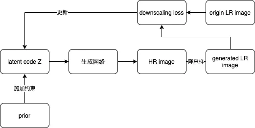

# GAN生成对抗网络

## 非条件GAN

1. **(PGGAN)Progressive Growing of GANs for Improved Quality, Stability, and Variation** [paper](https://arxiv.org/abs/1710.10196) | [code](https://github.com/tkarras/progressive_growing_of_gans) *ICLR2018*

   author: Tero Karras, Timo Aila, Samuli Laine,et al. NVIDIA

   > 采用渐进训练策略，先训练G和D的低分辨率小尺度层，**采用学习残差方式(保持网络稳定性)**来逐步加入大尺度层。

   

**2. (StyleGAN)Progressive Growing of GANs for Improved Quality, Stability, and Variation** [paper](https://arxiv.org/abs/1812.04948) | [code](https://github.com/NVlabs/stylegan) *CVPR2019*

author: Tero Karras, Samuli Laine, Timo Ailaet. NVIDIA

> 将Z高斯分布的latent code投影到W空间(**disentanglement**)，**控制生成图像的风格style，加入的noise调节图像的细节**，style和noise借助style transfer的常用AdaIN操作。

**3. (PULSE)Pulse: Self-supervised Photo Upsampling via Latent Space Exploration of Generative Models** [paper](https://arxiv.org/pdf/2003.03808) | [code](https://github.com/adamian98/pulse) *CVPR2020*

author: Sachit Menon, Alexandru Damian, Shijia Hu, et al. Duke University

> 1. 提出了超分算法的新范式：结合预训练好的StyleGAN，以完全**无监督**实现，不需要成对的LR-HR图像进行训练。
> 2. 不同于以往超分学习LR到HR的映射思路(SRCNN或者SRGAN)，本文采用GAN Inversion反演思路，首先生成器G用高斯分布约束初始化latent code, 结合StyleGAN来生成目标HR图像，降采样后和原始的LR图像在判别器D通过downscaling loss来**优化latent code**，以此来生成更好的HR图像。

## 条件GAN

**1. (SRGAN)Photo-Realistic Single Image Super-Resolution Using a Generative Adversarial Network** [paper](https://arxiv.org/abs/1609.04802) | [code](https://github.com/tensorlayer/srgan)  CVPR2017

authors: Christian Ledig, Lucas Theis, Ferenc Huszar, et al. Twitter 

> 1. SGGAN由SSResNet Generator和Discriminator组成，损失函数由对抗损失adversarial loss(**结合GAN提高真实感**)和内容损失content loss组成，而content loss由MSE损失(**像素级相似性**)和**perceptual loss感知损失**(**特征相似性**)组成。
>
> 2. **perceptual loss感知损失**是基于VGG不同卷积层输出的feature map的MSE损失
> 3. 结合GAN的训练方式(**条件GAN**)和**感知损失**使超分修复图像更符合人眼感知(MOS主观评估手段)，而PSNR/SSIM越高，人眼感知效果可能下降。

