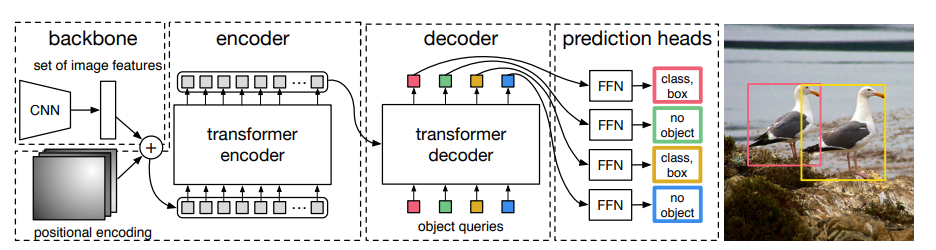
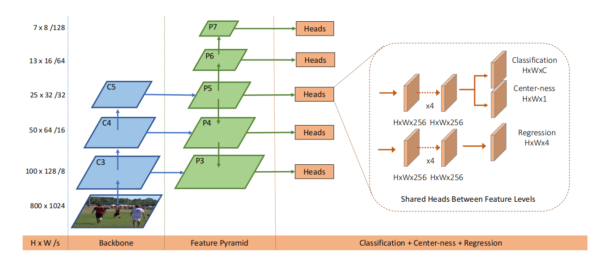

# Object Detection 目标检测

## Transformer

1. **(DETR)End-to-End Object Detection with Transformers** [paper](https://arxiv.org/abs/2005.12872) | [code](https://github.com/facebookresearch/detr) *ECCV2020*

   author: Nicolas Carion, Francisco Massa, Gabriel Synnaeve et al. Facebook AI

   > 结合CNN+**纯Transformer结构**，利用二分图匹配匈牙利算法计算loss，采用**序列预测**(set prediction)方式，摒弃proposal、anchor、nms等检测设计。

   

## Anchor-free

1. **(FCOS) Fully Convolutional One-Stage Object Detection** s

   author: Zhi Tian, Chunhua Shen, Hao Chen et al.

   motivation: 

   * 检测器性能与Anchor的size、aspect ratio相关，迁移不同任务需要重新设计anchor。

   * 为了达到更高的召回率，需要生成密集的Anchor Boxes，训练过程正负样本比例极度不均。
   * Anchor的引入使得网络在训练过程更加繁琐。

   正负样本匹配：将位于GT box的点映射到feature map的cell作为正样本，区别于anchor IOU思路。（Ambiguity问题，默认分配给Area最小的GT Box, 采用FPN结构）

   loss: 分类损失采用BCELoss+FocalLoss, 回归损失采用GIoULoss, centerness中心点损失采用BCELoss.

