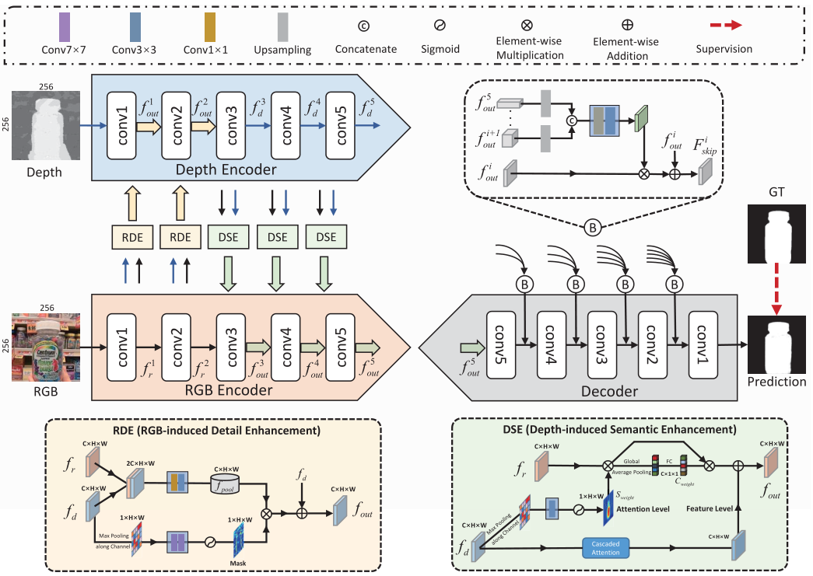

# multi-modal

## V-L 视觉-语言

1. **(CLIP)Learning Transferable Visual Models From Natural Language Supervision** [paper](https://arxiv.org/abs/2103.00020) | [code](https://github.com/openai/CLIP) *ICML2021*

   author: Alec Radford, Jong Wook Kim, Chris Hallacy, et al.  OpenAI

   > State-of-the-art computer vision systems are trained to predict a fixed set of predetermined object categories. 
   >
   > This restricted form of supervision limits their generality and usability since additional labeled data is needed to specify any other visual concept. 
   >
   > Learning directly from raw text about images is a promising alternative which leverages a much broader source of supervision. 
   >
   > We demonstrate that the simple pre-training task of predicting which caption goes with which image is an efficient and scalable way to learn SOTA image representations from scratch on a dataset of 400 million (image, text) pairs collected from the internet. 
   >
   > After pre-training, natural language is used to reference learned visual concepts (or describe new ones) enabling zero-shot transfer of the model to downstream tasks. 

   

## RGB-D Cross-Modality Fusion for Perception Tasks

**Cross-modality Discrepant Interaction Network for RGB-D Salient Object Detection** [paper](https://arxiv.org/abs/2108.01971) | [code](https://github.com/1437539743/CDINet-ACM-MM21) *ACMMM2021*

author: Chen Zhang, Runmin Cong, Sam Kwong et al. BJTU

> salient object detection (SOD) algorithms concentrate on how to better integrate cross-modality features from RGB image and depth map.
>
> Different from them, we reconsider the status of two modalities and propose a novel Cross-modality Discrepant Interaction Network (CDINet) for RGB-D SOD, which **differentially models the dependence of two modalities according to the feature representations of different layers**.
>
> 1) the **RGB-induced Detail Enhancement** (RDE) module leverages RGB modality to enhance the details of the depth features in low-level encoder stage.
>
> 2) the **Depth-induced Semantic Enhancement** (DSE) module transfers the object positioning and internal consistency of depth features to the RGB branch in high-level encoder stage. 
>
> 3)we also design a **Dense Decoding Reconstruction** (DDR) structure, which constructs a semantic block by combining multi-level encoder features to upgrade the skip connection in the feature decoding. 

